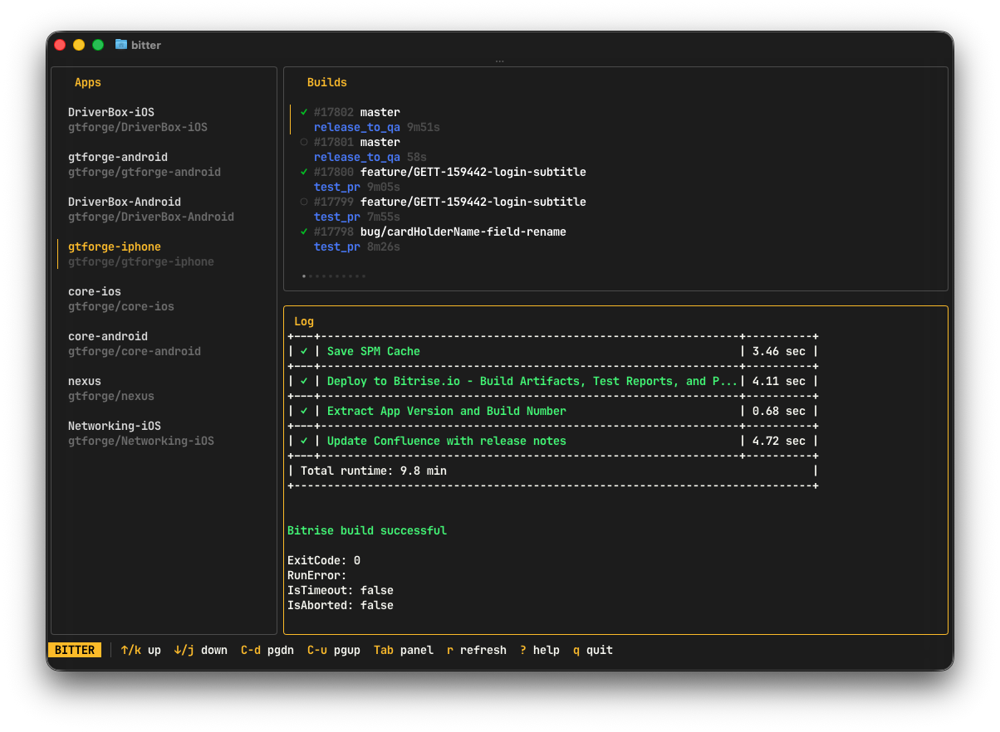

# bitter

A LazyGit-style terminal UI for [Bitrise CI](https://bitrise.io). Browse apps, view builds, read logs, trigger builds, and abort running ones — all from the terminal.




## Features

- **Three-panel layout** — apps sidebar, builds list, log viewer
- **Vim-style navigation** — `j`/`k`, `g`/`G`, `Ctrl-d`/`Ctrl-u`
- **Trigger builds** — choose branch and workflow from a dialog
- **Abort running builds** — with confirmation prompt
- **Auto-refresh** — running builds poll every 5 seconds
- **Build status icons** — visual indicators for success, failure, running, aborted, on-hold
- **Open in browser** — jump to the build on Bitrise
- **Copy URL** — copy build URL to clipboard
- **Filter/search** — fuzzy search within any list panel

## Install

Requires [Go 1.25+](https://go.dev/dl/):

```bash
go install github.com/oronbz/bitter@latest
```

Or build from source:

```bash
git clone https://github.com/oronbz/bitter.git
cd bitter
make build
```

## Setup

Run the interactive setup to configure your Bitrise API token:

```bash
bitter setup
```

This opens the Bitrise security page in your browser, prompts you to paste your token, validates it, and saves it to `~/.config/bitter/config.toml`.

Alternatively, set the `BITRISE_TOKEN` environment variable:

```bash
export BITRISE_TOKEN=your-token-here
bitter
```

## Usage

```bash
bitter
```

### Key Bindings

#### Navigation

| Key | Action |
|-----|--------|
| `j` / `k`, `↑` / `↓` | Navigate lists / scroll logs |
| `Enter` | Select item |
| `Tab` / `Shift-Tab` | Switch panel |
| `g` / `G` | Jump to top / bottom |
| `h` / `l`, `←` / `→` | Previous / next page |
| `Ctrl-d` / `Ctrl-u` | Page down / page up |
| `/` | Filter/search within panel |

#### Actions

| Key | Action |
|-----|--------|
| `t` | Trigger new build |
| `a` | Abort running build |
| `r` | Refresh current view |
| `o` | Open build in browser |
| `c` | Copy build URL to clipboard |

#### General

| Key | Action |
|-----|--------|
| `?` | Toggle help overlay |
| `Esc` | Close dialog / overlay |
| `q` / `Ctrl-C` | Quit |

## Layout

```
┌─────────┬──────────────────┐
│  Apps   │     Builds       │
│         │                  │
│         ├──────────────────┤
│         │     Log          │
│         │                  │
└─────────┴──────────────────┘
 status bar
```

The log panel appears after selecting a build. Tab between panels to navigate.

## Built With

- [Bubble Tea](https://github.com/charmbracelet/bubbletea) — TUI framework (Elm Architecture)
- [Lip Gloss](https://github.com/charmbracelet/lipgloss) — Styling and layout
- [Bubbles](https://github.com/charmbracelet/bubbles) — TUI components (list, viewport, textinput, spinner)

## License

MIT
